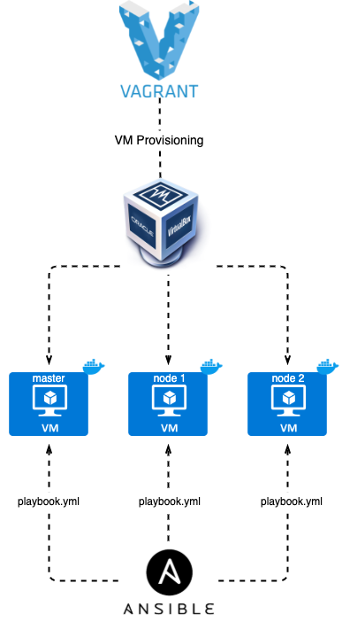
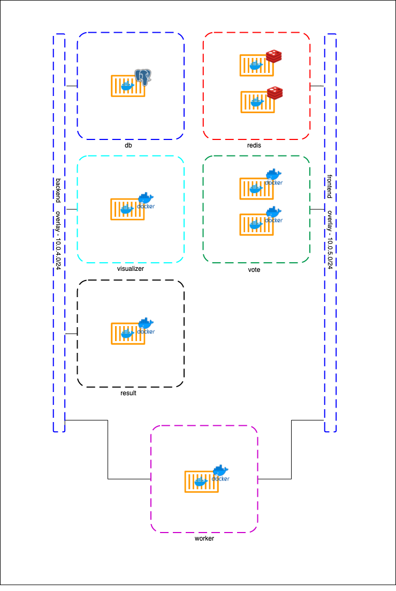
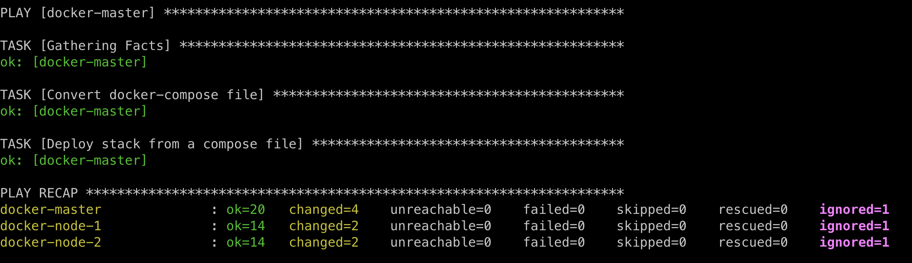
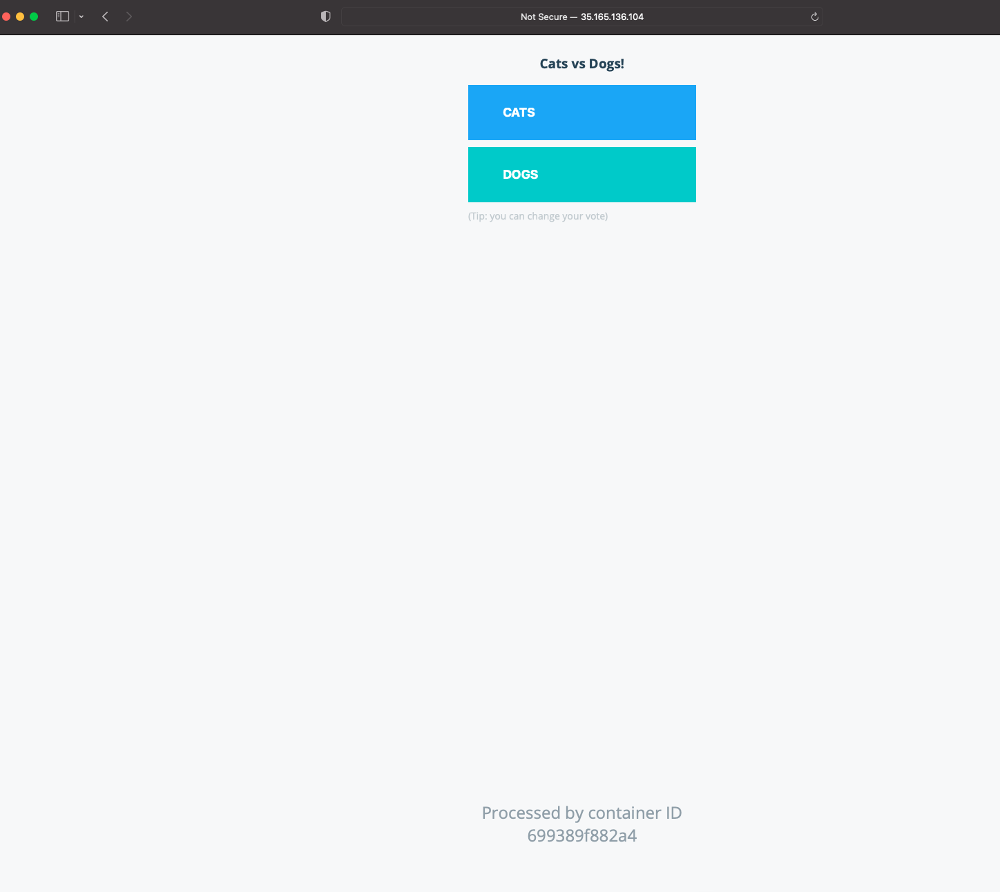

# Vagrant Docker Swarm Automation

This pipeline is based on this [documentation](https://medium.com/@lessandro.ugulino/docker-swarm-part-5-d7ccccb98ff8). It will deploy six docker swarm services on [VirtualBox](https://www.virtualbox.org/) via [Vagrant](https://www.vagrantup.com/).

## Index

- [Requirements](#requirements)
- [Architecture](#architecture)
- [How to Deploy](#how-to-deploy)
- [Optional: Access Vagrant Virtual Machine](#optional:-access-vagrant-virtual-machine)
- [Result](#result)
- [Delete the env](#delete-the-env)

## Requirements

These tools need to be installed on your local machine or the computer that will run Ansible:

- <a href="https://www.vagrantup.com/downloads">Vagrant</a>
- <a href="https://www.virtualbox.org/wiki/Mac%20OS%20X%20build%20instructions">VirtualBox</a>
- <a href="https://docs.ansible.com/ansible/latest/installation_guide/intro_installation.html#installing-ansible-on-macos">Ansible</a>

## Architecture

This automation will deploy 2 docker nodes and 1 docker master as shown below.



_Docker application that will be deployed via this automation_



# How to Deploy

Execute on the current folder:

```
vagrant up --no-provision
```

Once the provisioning is done, run the below command

```
vagrant provision
```

## Optional: Access Vagrant Virtual Machine

You can access the VM executing the below command on the current folder

```
vagrant ssh docker-master
```

This command will `ssh` to docker-master VM.

## Result

The below output is expected, and once it's done you can access `192.168.165.117` IP address on ports `5000` and `5001`





## Delete the env

```
vagrant destroy
```
